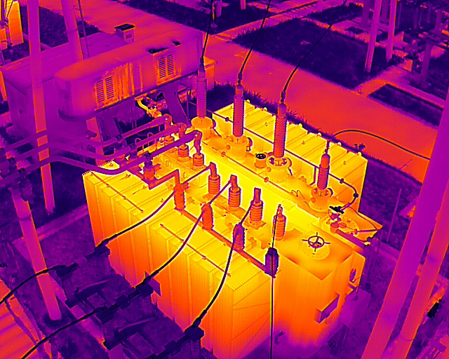
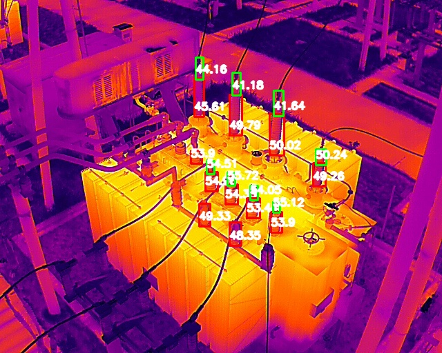

## 红外套管图像温度识别

### 1. 简介
基于大疆指定型号机器拍摄出的红外图像作为原始输入, 使用yolov9训练红外套管目标识别和目标分割模型, 结合大疆测温sdk获取目标区域的最大温度, 以此得到红外套管、接线掌区域最大温度, 减少人力, 提升检测效率和准确率.

大疆支持的产品型号见: https://www.dji.com/cn/downloads/softwares/dji-thermal-sdk

### 2. 快速开始

#### step1: 安装依赖包

创建conda环境, 安装对应依赖: `pip install -r requirements.txt`

#### step2: 训练模型

该温度识别共训练3个模型, 均基于yolov9e预训练权重进行fine-tuning.分别是:
* 红外套管目标识别模型: 标注红外套管和接线掌两个目标
* 套管目标分割模型: 多边形标注套管目标, 训练分割模型, 分割出套管轮廓
* 接线掌目标分割模型: 多边形标注接线掌目标, 训练分割模型, 分割出接线掌轮廓

训练方式参照[yolo官方教程](https://docs.ultralytics.com/zh/models/yolov9/#usage-examples)
```
from ultralytics import YOLO

# Build a YOLOv9c model from pretrained weight
model = YOLO("yolov9c.pt")

# Display model information (optional)
model.info()

# Train the model on the COCO8 example dataset for 100 epochs
results = model.train(data="coco8.yaml", epochs=100, imgsz=640)

# Run inference with the YOLOv9c model on the 'bus.jpg' image
results = model("path/to/bus.jpg")
```


yolov9预训练权重: https://docs.ultralytics.com/zh/models/yolov9/#__tabbed_1_1

自行准备训练的yolo模型格式数据

#### step3: 安装大疆测温sdk
官方地址: https://www.dji.com/cn/downloads/softwares/dji-thermal-sdk

> 方式一: 基于官方README安装

按照官方的说明进行安装, 安装步骤:
* 安装cmake3.13.3, 确认gcc版本: `cmake --version`
* 确认gcc版本: `gcc --version`
* 运行脚本安装: `bash build.sh`

参考:
* cmake编译: https://blog.csdn.net/weixin_35755562/article/details/129072751
* dji-thermal-sdk编译: https://blog.csdn.net/qq_16792139/article/details/112990583


linux测试:
* 对sdk中的测试图像生成raw图: `./dji_irp -s /path/to/your/img.JPG -a measure -o measure_01.raw`
* 参考[官方论坛说明](https://bbs.dji.com/pro/detail?mod=viewthread&tid=290236), 输出温度数据:
```python
img = np.fromfile('/path/to/your/raw_img/measure_01.raw', dtype='uint16')

img = img / 10 #官方说明, 输出INT16数据类型后每个数据除以10即为温度值

print(img.shape)

print(max(img))
print(min(img))
```

注意事项:
* 包含x86和x64两个版本, 需要确认具体版本
* 编译后的可执行文件可能没有权限, 需要用更新权限 `chmod +x`
* linux下编译完成后, 可能存在.so动态库链接缺失问题, 需要手动自行链接, 链接完后`ldd dji_irp`查看是否成功链接。以下为服务器调试示例:
    * 修改~/.bashrc文件, 添加内容(路径自行修改): `export LD_LIBRARY_PATH=/home/kemove/zyq/giit/yolo_taoguan/dji/utility/bin/linux/release_x64:$LD_LIBRARY_PATH`
    * 执行`source ~/.bashrc`
    * 确认可执行文件是否链接成功:
        ```txt
        $ ldd dji_irp
                linux-vdso.so.1 (0x00007ffd60097000)
                libdirp.so => /home/kemove/zyq/giit/yolo_taoguan/dji/utility/bin/linux/release_x64/libdirp.so (0x00007f3d228d4000)
                libstdc++.so.6 => /lib/x86_64-linux-gnu/libstdc++.so.6 (0x00007f3d224a6000)
                libgcc_s.so.1 => /lib/x86_64-linux-gnu/libgcc_s.so.1 (0x00007f3d2248b000)
                libpthread.so.0 => /lib/x86_64-linux-gnu/libpthread.so.0 (0x00007f3d22468000)
                libc.so.6 => /lib/x86_64-linux-gnu/libc.so.6 (0x00007f3d22274000)
                libm.so.6 => /lib/x86_64-linux-gnu/libm.so.6 (0x00007f3d22125000)
                libgomp.so.1 => /lib/x86_64-linux-gnu/libgomp.so.1 (0x00007f3d220e3000)
                /lib64/ld-linux-x86-64.so.2 (0x00007f3d22b0c000)
                libdl.so.2 => /lib/x86_64-linux-gnu/libdl.so.2 (0x00007f3d220dd000)
        ```
**注: 以此方式安装sdk后, 需要用python去拉起系统调用, 此外输出的raw图是一维数组, 需要做后处理而不能直接调用**


> 方式二: 安装python版本dji-thermal-sdk(推荐)

相较于方式一的原生sdk安装方式，建议使用第三方开源的[python版本dji-thermal-sdk](https://github.com/SanNianYiSi/thermal_parser)。测试对比过官方示例图像，输出的温度数据基本一致。该方式的优点：输出为原图像的温度矩阵，无需做过多的后处理。

安装方式: 参考原github仓库步骤即可, 推荐运行`thermal_test.py`确认是否成功

**注**: 可能会遇到exiftool的相关报错, 原因是安装环境中没有exiftool, 可通过官网教程安装: https://exiftool.org/install.html

#### step4: 运行程序识别目标区域温度
整体思路: 先将原图输入大疆红外测温api, 得到原图像的温度矩阵, 再通过目标检测+分割模型识别出具体区域, 分割模型用于剔除掉目标以外的干扰区域, 减少因目标外区域温度高于目标本身, 而影响最大温度输出值. 使用的模型harcode名称为['xianzhang', 'taoguan'], 可根据实际情况修改.

运行步骤:
* 更新configs.py配置文件, 自行训练权重或使用[预训练权重](https://drive.google.com/drive/folders/12fyAINxXub5zx6oLKU-pbOmmlXIKdpsr?usp=sharing), 需放在`model_weights/v1/`下
* 是否输出中间结果根据configs.py配置文件中的`is_show`字段决定, 可自行修改
* `python main.py`生成识别后的图像, 包含目标区域和区域最高温度值

输入图像示例:



输出图像示例:



### 3.参考
* 大疆测温sdk
  * https://bbs.dji.com/pro/detail?tid=290236
  * https://www.dji.com/cn/downloads/softwares/dji-thermal-sdk
  * https://github.com/SanNianYiSi/thermal_parser
  * https://blog.csdn.net/qq_16792139/article/details/112990583
  * https://blog.csdn.net/weixin_35755562/article/details/129072751
* yolov9训练: https://docs.ultralytics.com/zh/models/yolov9/#usage-examples
